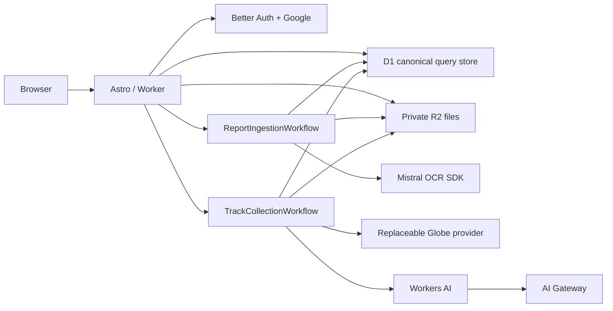

# Architecture

## Request and storage flow

The custom Worker entrypoint delegates HTTP traffic to Astro and exports both Workflow classes. Its scheduled handler starts a deterministic weekly track-collection instance every Monday at 10:15 UTC.

Durable Objects, KV, and Queues are deliberately absent. Workflow durability covers the two long-running, retryable flows without introducing more infrastructure.

## Data access layer

All application-owned D1 access goes through Drizzle. `src/db/schema.ts` models
the application and Better Auth tables, while `src/db/client.ts` is the only
place that turns a request-scoped `D1Database` binding into a Drizzle client.
The client is intentionally not cached in module state.

Queries are grouped by responsibility:

- `src/lib/db/public.ts` owns the published-trip visibility predicate, filters,
  pagination, and trip detail assembly.
- `src/lib/db/public-queries.ts` owns read models for public pages.
- `src/lib/db/admin-queries.ts` owns contributor reads, reviewed-row mutations,
  audit events, and atomic Drizzle batches.
- `src/lib/ingestion/publish.ts` owns the idempotent publication transaction.
- Workflow files keep workflow-specific persistence beside their durable step
  orchestration, using the same Drizzle client and schema.

Route and component files do not prepare SQL. New reusable data behavior belongs
in the closest query module, and callers pass either a Drizzle client or the D1
binding to the exported repository function. Complex SQLite features such as
FTS5, JSON aggregation, and date functions use Drizzle's parameterized `sql`
template; interpolated user values are never assembled into SQL strings.

Cloudflare D1 SQL migrations remain the deployment format. Drizzle Kit compares
`src/db/schema.ts` with its checked-in `migrations/meta` snapshots and generates
the next numbered SQL migration; Wrangler applies that reviewed SQL and records
the filename in D1's `d1_migrations` table. Do not use `drizzle-kit push` against
a shared or production database.

The pre-launch history is represented by `0001_initial.sql` and its matching
`0001_snapshot.json`. FTS5 virtual tables and synchronization triggers are
custom SQL outside Drizzle's relational schema model, so the Worker migration
suite asserts their presence along with foreign-key actions and indexes. For
future changes, edit `src/db/schema.ts`, run
`npm run db:generate -- --name describe_the_change`, review the SQL, and retain
the generated snapshot and journal entry. Use `drizzle-kit generate --custom`
when a migration contains only unsupported/custom SQL. Never hand-create a
numbered SQL file without the corresponding Drizzle journal and snapshot.

Run `npm run db:check`, `npm run db:migrate:validate`, and the Worker tests
before any remote apply. Once a shared database has applied a migration, do not
rewrite that migration; issue a new numbered migration instead.

## Publication visibility

Rows are inserted as `ready` while a batch is `publishing`. Public queries require both `trips.publication_state = 'published'` and the associated batch’s final `published` state. The final trip, document, and batch state transitions occur in one D1 batch, so partially written ingestion chunks are never public.

Duplicate rows are never silently merged. Reviewers choose `create`, `link_existing`, or `exclude`. An absent flight-path association does not block publication.

## OCR

The browser sends a raw PDF body plus SHA-256 and encoded filename headers. The Worker validates:

- authenticated and allowlisted contributor;
- same-origin mutation;
- exact `application/pdf` type;
- declared and streamed byte counts no larger than 50 MiB;
- `.pdf` filename and `%PDF-` magic;
- non-duplicate SHA-256;
- R2 checksum while streaming.

One `ReportIngestionWorkflow` handles each uploaded document. Its named `step.do(...)` operations are durable steps in that one Workflow, not separate Workflow instances. Source PDFs are immediately readable to the Workflow at an unguessable `datasources/pending/{sha256}/{filename}` route. After OCR identifies the source agency, the original is organized under a readable `datasources/{source}/{filename}` R2 key and matching route. Draft records at that final route require an admin session; publication makes the same route public and retires the pending alias. The Workflow gives the pending datasource URL to the official Mistral TypeScript SDK using the `MISTRAL_API_KEY` Worker secret. It makes one OCR request for HTML tables, page confidence, and the strict flight-log array schema in `src/lib/ocr/schema.ts`. Image data and content bounding boxes are disabled. Complete provider responses are stored in R2. Only keys, model/status/usage metadata, and staged records remain in D1. AI Gateway remains available for Workers AI and other model-assisted tasks, but OCR does not pass through it.

The returned array is mapped back to page and row provenance using each page’s HTML-table row count. A schema or row-count mismatch fails validation instead of launching another OCR request; the contributor can explicitly retry the document. Low page confidence is carried into staged-row warnings. Structured output remains a draft until every row is reviewed.

## Flight paths

The provider interface isolates Globe-specific URL and payload behavior. Trace offsets are converted to UTC and the Globe/readsb flags are normalized into provider-neutral telemetry fields. The provider's `start of a new leg` flag is the primary segment boundary. Sustained ground periods and 30-minute telemetry gaps remain defensive fallbacks for traces without a usable leg marker; a point before a telemetry gap is never copied into the following segment.

Each retained point includes reported barometric/geometric altitude, ground speed, track, vertical rate, ground/stale state, and source where available. Complete normalized telemetry is stored as a compressed R2 artifact for each observed segment. D1 retains its key, source hash, full telemetry point count, and altitude bounds. This canonical artifact does not use the 90-day raw-provider expiration.

Geometry simplification begins at 75 metres and increases until no more than 500 points remain. Endpoints are always preserved. Simplified geometry carries aligned timestamp, altitude, speed, vertical-rate, ground, stale, and source arrays for lightweight map use. The current geometry and its provenance live directly on the observed-flight row. Contributor trim/split/merge/correct operations mark it as manual and write an audit event with the actor, operation, note, and before/after metadata. Provider refreshes do not supersede manually corrected geometry automatically.

Matching evaluates ordered bundles of consecutive observed segments against a reported trip. Bundle duration is the sum of observed segment durations, so a stop or telemetry outage between legs is not counted as flight time. Scoring considers aircraft, the West Virginia local reporting date, summed duration, expected leg count, and ordered route-stop coverage when resolved place coordinates are available. Multi-leg trips are attached as one audited D1 batch. Single-segment matching remains a fallback for reported routes with one leg.

Raw provider responses use `raw/` R2 keys and carry 90-day expiry metadata. The weekly workflow deletes expired raw objects and clears their D1 keys. Configure an R2 lifecycle rule as defense in depth.

The same Workflow has a dormant `repair` mode. It defaults to a dry run, reads stored R2 responses first, refuses provider fetches unless explicitly enabled, caps provider requests, and spaces permitted provider requests one second apart. See `docs/track-repair.md`; deploying the code does not start a repair.

The public `/trips` feed contains published report trips only. Observed flights remain normalized provider records used for maps and matching; confirmed observations enrich their linked report trip, while observation-only records are not included in the public trip feed or site trip totals. The collection and matching workflows therefore do not create synthetic `trips` rows for provider-only data.

## Search

FTS5 indexes route, passenger text, department, division, comments, and justification. Public trip filters operate only on published report trips; there is no public filter for observation-only records. Public queries cap page size at 100. Geometry is loaded only by detail and map pages that need it.
